# Amplience SFCC Hooks Bridge

This mini cartridge contains hooks designed to work with our [Amplience Salesforce Composable Commerce (ASCC)](https://github.com/amplience/amplience-sfcc-composable-commerce) implementation to facilitate Content Personalization. The hooks extend OCAPI endpoints and enable us to get the groups a customer belongs to, as well as **ALL** user groups present on a SFCC site that enable special preview features in our **ASCC** *Preview Toolbar*.

If you'd like to use our extended personalized content  features in **`ASCC`** you'll need to set this cartridge up on your SFCC instance. Below is a step by step walkthrough of that process.

## Setting up your SFCC Sandbox/instance

### Connect VSCode to your On-Demand Sandbox

First, clone the repo, then in VS Code, install Prophet Debugger:

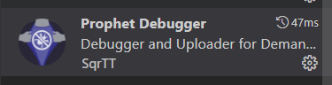

### Configure dw.json

In the Project Root you’ll see a file named `dw.example.json`. Copy the contents of that file into a new file named `dw.json` and replace the values in your new file with the correct info for your ODS (On-demand Sandbox). Below is the sample file..

```
{
    "hostname": "example.demandware.net",
    "username": "user",
    "password": "password",
    "cartridgesPath": "cartridgeA:cartridgeB",
    "code-version": "version1"
}
```


Verify the `code-version` you enter is the active code version in Business Manager by clicking on the “Code Versions” arrow. Your active version is marked by a green arrow. In the example screen below, I know I need to replace `version1` with `SFRA_UPC_05_04_2021`. Now Save `dw.json`.

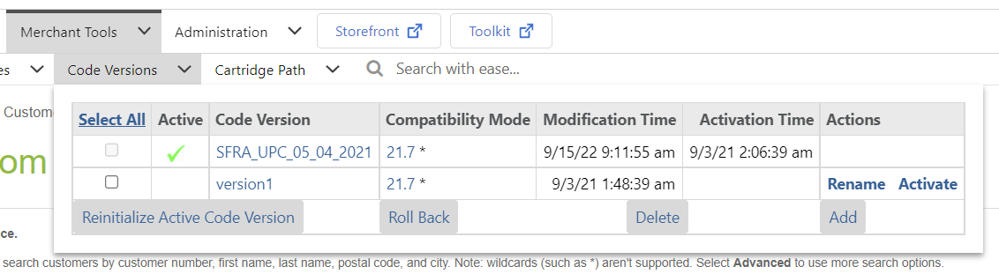

### Configure Prophet Debugger

In your VS Code Workspace settings, nav into Extensions settings and:


**Uncheck** *Extension > Prophet > Clean > On: Start*

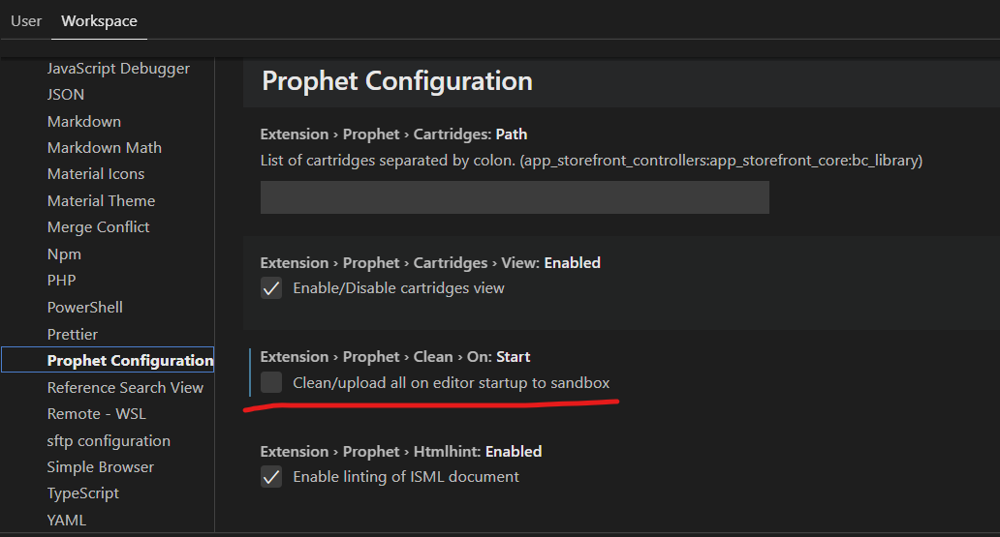

and **Enable** *Extension > Prophet > Upload*

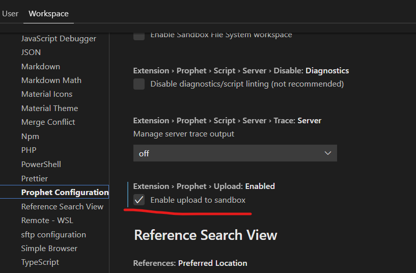

VS Code will now upload your cartridge.

## Configure your ODS

### Verify Upload

To verify the cartridge uploaded correctly, click on the active Code Version in BM

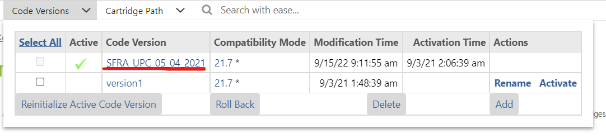

Then click on the **WebDav** link

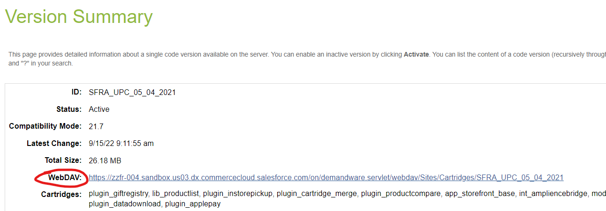

In your Parent Directory you should see the `int_ampliencebridge` cartridge

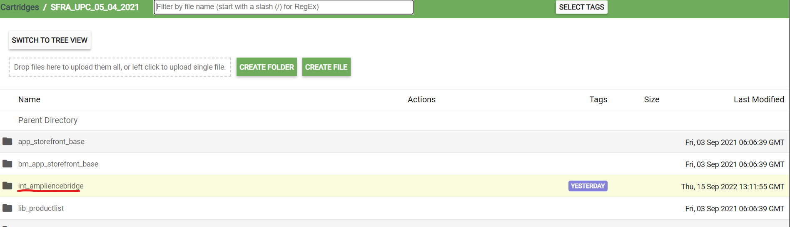

### Update Cartridge Path

Now click on the Cartridge Path quick menu, and drag/drop `int_ampliencebridge` over to the top of your cartridge path.

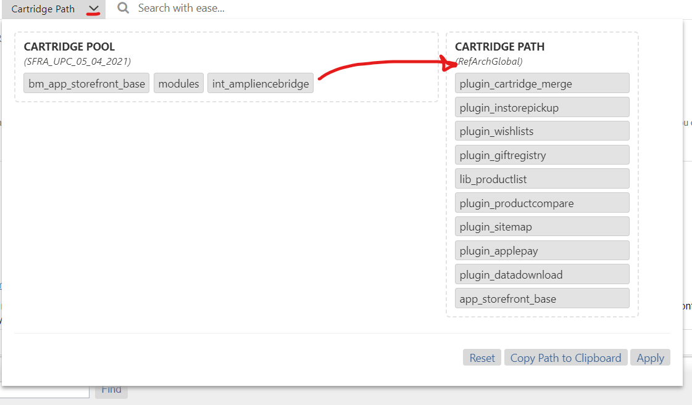

It should look like this, now click **Apply**

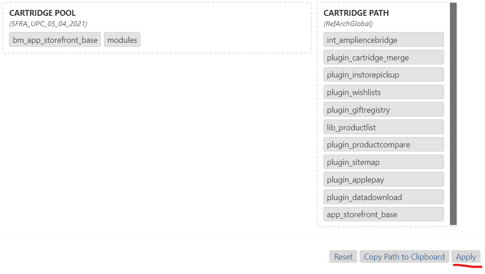

### Enable OCAPI Folders GET access

In *Admin > Site Development > Open Commerce API Settings*, add the following resource to your **`shop`** settings:

```
{
	"methods": [
		"get"
	],
	"read_attributes": "(**)",
	"resource_id": "/folders/*"
}
```

### Enable OCAPI Hooks

You’re almost done. Goto *Admin > GLobal Preferences > Feature Switches*,

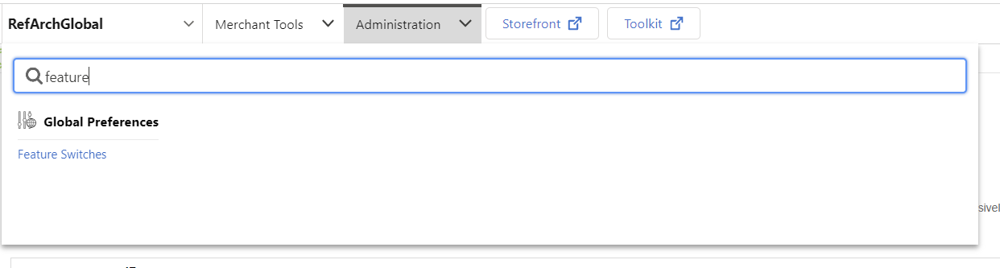

and check the **Enable Salesforce Commerce API Hook Execution** option.

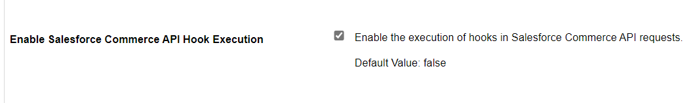
